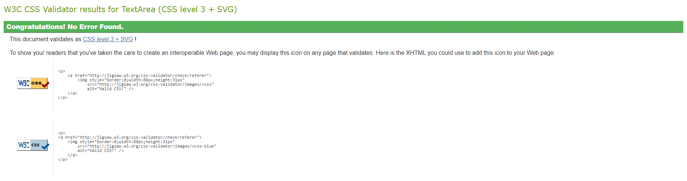

#thebod blog
**Created by Joe Playdon**
[View Live Website](https://thebod-blog.herokuapp.com/)

## About

"thebod" is a fitness blog website where users can share images and posts about anything gym related, to keep themselves and users motivated and inspired.
Every user that creates an account can have access to view all posts that have been made- and are able to like the posts that they like, and follow the users that they want to see more posts from (these display in the users feed).
This blog is for all fitness lovers, amateur or expert- to share their healthy and friendly advice with other users. 

## Project Goals

The goal of this project was for me to put a twist on a usual blog, add interactive and fun colour schemes and relate it to fitness- a topic I am passionate about. I really wanted this website to engage the user and have a fun and refreshing feel to it.

Required functions that my website needed:
- Good user experience and a clear understanding of the user flow
- User engagement (posting, liking, commenting, following)
- User login authentication status
- Full CRUD functionality for posts, comments, likes, followers and profile data
- Profiles that could be personalised (images, bio)
- Filtering posts by tags
- Filtering posts by search functionality of data related to a post (title, user)
- Like filtering by viewing all previously liked posts
- Feed filtering by viewing all followed user's posts
- Mobile responsiveness for website to be fully functionable and accesable on different screen sizes

## User Stories

#### Navigation 

1. As a user I can view the home page so that I can understand the use and purpose of the blog site
2. As a user I can view the navigation bar at all times so that I have easy access to switch to any page for good user experience
3. As a previous or new user I can view the log in and sign up buttons so that I can log into an account or create an account
 
#### Authentication 

4. As a new or existing user I can create an account so that I can access all login required features to the website
5. As a previous user I can log into my account so that I can access all features for a logged in user
6. As a user I can remain logged in when changing pages so that I can use the app as I please until I log out

#### Posts

7. As a user I can post content on the website so that I can keep my following users up to date on my fitness goals, and upload images
8. As a user I can view the tags related to a post so that I can see how relevant the content is to me as a user
9. As a user I can like or unlike a post so that I can show my opinion on somebody else's content, to give feedback 
10. As a user I can view any other user's specific posts so that I can see all the latest activity on their posts, and see all previous posts they have made
11. As a user I can view the date a post was uploaded on so that I can know how time relevant the post is, and if it is worth viewing

#### Post Detail Page 

12. As a user I can view more information on a specific post so that I can see the entirety of the content related to the post they have made
13. As a user I can view posts that are associated with tags so that I can search for more specific results catered to me
14. As a user I can comment on a post so that I can show my feedback and share my opinion
15. As a user I can see when a comment was posted so that I know if it is a new or old comment
16. As a user I can edit my comments so that I can change any of my comments and the text inside of them
17. As a user I can click the delete comment button so that I can remove any comments I have made if I choose to 
18. As a user I can edit my posts so that I can change the content in my post if I choose to  

#### Main feed page

19. As a user I can view the most recent posts so that I can view the newest and therefor most date relevant content on my feed
20. As a user I can infinitely scroll the website so that I can easily view all posts on the site without interruption
21. As a user I can view the posts that I have previously liked so that I can freely view the content that I like or find informative
22. As a user I can view a list of all relevant posts so that I can see content that has been uploaded by the users I follow
23. As a user I can use the search bar so that I can filter the content I want to see
24.As a user I can view posts that are associated with tags so that I can search for more specific results catered to me

#### Profile Page 

25. As a user I can upload a profile picture so that I can style my profile to make me recognisable
26. As a user I can view other user's profile pictures so that I can identify the user by their image
27. As a user I can update my profile picture so that I can decide to change my picture if I choose to
28. As a user I can update my profile bio so that I can write a little about myself and personalise my own profile
29. As a user I can change my password so that I can keep my profile secure

#### Other Site Users
30. As a user I can view any other user's specific posts so that I can see all the latest activity on their posts, and see all previous posts they have made
31. As a user I can view other profiles so that I can stay up to date on their following, followed and posts
32. As a user I can view a profile picture and a name so that I can check a user's profile page
33. As a user I can view the most popular profiles so that I can see who the most followed users on the site are
34. As a user I can use the follow and unfollow buttons on a user so that I can choose what content I want to see on my feed, and filter the content

#### User Experience

35. As a site owner I want my blog app to be responsive so that my users can view the website on any device they choose with any screen size
36. As a user I can view a no results found error page so that I know the page I am on has no content

## Design Choices

### Colour Scheme

My colour scheme that I decided to use within my app was aimed to be a fun and interactive website to use and look at. The purple background colour (#9247cf) that I chose to use was both abstract and modern but fun to look at- and the goal of my blog was to make sure the journey a user goes through is visually appealing. Firstly, I designed the purple background to work hand in hand with the infinite scrolling functionality due to the fact that the longer the page gets, the background gradients to a lighter colour, keeping the user experience interesting as they scroll further. I kept this purple theme throughout the use of all icons on hover, including the placeholder profile picture a user is assigned on creation of account. The foreground colours are mostly white to allow for a clear depiction of all information displayed to a user when navigating the website (posts, profiles, login/signup pages). Styling this page was one of my favourite parts of creating this project- as it allowed me to explore my creative side.

Furthermore, I kept the toolbar icon colour scheme consistent using a teal colour for the "create post" icon (#51a7a7), a red for the "liked posts"/ "my hearts" icon (#e52828) and finally a dark blue colour (#493fd4) for the "my feed" icon. I wanted these icons to have specific colours for a user to easily identify what they want to do and have an intuitive experience on my site.

### Fonts

For my fonts within my website, I used Google Fonts- as my main font, I decided to use Varela Round as it is very easy to look at and fits the fun style of my website. I wanted a font that wasn't too formal nor informal and Varela fit the style. Sans Serif was the fallback font- due to the fact that the website needed consistent styling and sans also fits the style in case fallback is needed.

   

### Wireframes
        
  -   I have used [Balsamiq Wireframes](https://balsamiq.com/) as my desired wireframing tool for my website, as it is very easy to use. However, due to these being wireframes, the final image of the website may be depicted differently yet these are base guidelines of my website, and the image I would like to achieve. I have made wireframes for both mobile and desktop views of the website.

  -   Home Page Desktop Wireframe - [View](/docs/wireframes/thebod-home-page.png)

  -   Home Page Mobile Wireframe - [View](/docs/wireframes/thebod-homepage-mobile.png)
  -   Login Page Desktop Wireframe - [View](/docs/wireframes/thebod-login-page.png)

  -   Login Page Mobile Wireframe - [View](/docs/wireframes/thebod-mobile-login.png)

  -   Signup Page Desktop Wireframe - [View](/docs/wireframes/thebod-signup-desktop.png)
  -   Signup Page Mobile Wireframe - [View](/docs/wireframes/thebod-signup-mobile.png)
  -   Home Feed Page Desktop Wireframe - [View](/docs/wireframes/thebod-blog-home-feed.png)
  -   Home Feed Page Mobile Wireframe - [View](/docs/wireframes/thebod-home-mobile-home-feed.png)
  -   Post Detail Page Desktop Wireframe - [View](/docs/wireframes/thebod-blog-post-detail.png)
  -   Post Detail Page Mobile Wireframe - [View](/docs/wireframes/thebod-home-mobile-post-detail%20.png)
  -   Create Post Page Desktop Wireframe - [View](/docs/wireframes/thebod-blog-create-post.png)
  -   Create Post Page Mobile Wireframe - [View](/docs/wireframes//thebod-mobile-post-create.png)
  -   Profile Detail Page Desktop Wireframe - [View](/docs/wireframes/thebod-blog-profile-detail.png)
  -   Profile Detail Page Mobile Wireframe - [View](/docs/wireframes/thebod-profile-detail-mobile.png)
  -   Profile Edit Page Desktop Wireframe - [View](/docs/wireframes/thebod-blog-edit-profile.png)
  -   Profile Edit Page Mobile Wireframe - [View](/docs/wireframes/thebod-profile-edit-mobile.png)
  -   Profile Password Change Page Mobile Wireframe - [View](/docs/wireframes/thebod-passwordchange-mobile.png)

## Technologies Used

### Languages

- HTML
- CSS
- Javascript
- React 17.0.2

### Libraries, frameworks and dependencies

- [Axios](https://axios-http.com/docs/intro) - Axios was used for promise-based HTTP requests. Justification: I have used Axios within my front end to send different types of requests to my API to send and retrieve data for the user to view. This prevented me from getting Cross-origin resource sharing errors (enabled the browser to have controlled access to the data in my api domain).
- [JWT](https://jwt.io/) - this is a library that I used to decode JSON Web tokens. Justification: I used JWT to prevent unauthenticated user from making extra network requests to refresh their access token. This allowed me to set and remove authentication tokens to allow the site to know the login status of a user (if logged out, no authentication token is set within cookies).
- [React 17](https://17.reactjs.org/) - JavaScript library for building user interfaces. Justification: This allowed for multiple encapsulated components to be used that manage their own state. React is extremely useful for this reason, and it also updates the data when data changes.
- [React-Bootstrap 1.6.3](https://react-bootstrap-v4.netlify.app/) - React bootstrap was used to import many different components on my website that are mobile responsive, and have preset classes and styles. Justification: This allowed for a faster building process of the features within my website, as I could have a functional based thought process behind the features, worrying less about html styling.
- [React Router](https://v5.reactrouter.com/web/guides/quick-start) - This was used for dynamic routing. Justification: This was extremely useful as it allowed me to set what content the user views based upon the URL they are visiting. This allowed me to build all pages of my site, and the functional route paths.
- [React Infinite Scroll](https://www.npmjs.com/package/react-infinite-scroll-component) - React Infinite Scroll was a very important feature of my website as the aim was to keep the user engaged. Justification: I used this component to load all content (posts & comments) automatically as the user scrolls towards the bottom of the page, which meant that the content was never taken away from the user.
- [Popper](https://popper.js.org/) - this is a 3rd party library used by React-Bootstrap. Justification: Popper was simply used to position the dropdown menu elements to fixed on screen.

### Tools & Programs

- [Deviceframes](https://deviceframes.com/) was used to create the design mockups at the top of this README
- [Balsamiq](https://balsamiq.com/) to make my wireframes for different screens
- [Cloudinary](https://cloudinary.com/) to store static files
- [Coolors](https://coolors.co/?home) was used to create the color scheme palette
- [Formito](https://formito.com/tools/favicon) for making my website's favicon
- [Chrome Developer Tools](https://developers.google.com/web/tools/chrome-devtools/) was used for debugging of the code and checking site for responsiveness
- [Google Fonts](https://fonts.google.com/) - for my Varela Rounded font
- [GitHub](https://github.com/) was used as a remote repository to store project code
- [Image Colour Picker](https://imagecolorpicker.com/en) - used colour grabber for favicon colours and logo
- [Image Compressor Picker](https://imagecompressor.com/) - used to compress all images on my site to keep the website higher on performance
- [Git](https://git-scm.com/) was used to commit and push my repository changes to github
- [Font Awesome](https://fontawesome.com/) - icons from Font Awesome were used on my website
- [React Icons](https://react-icons.github.io/react-icons/search) - icons from react-icons were used on my website
- [React Spinners](https://www.davidhu.io/react-spinners/) - spinner came from this website and I changed the coloir
- [Visual Studio Code](https://code.visualstudio.com/) - Was my chosen workspace to code this project
- [Heroku](https://dashboard.heroku.com/apps) was used to deploy my code live
- [ESLint](https://eslint.org/) used to validate JSX code
- [WC3 Validator](https://validator.w3.org/) was used to validate my HTML
- [Lighthouse Tools](https://developers.google.com/web/tools/lighthouse/) used to validate performance, accessibility, best practices and SEO of my website
- [Jigsaw W3 Validator](https://jigsaw.w3.org/css-validator/) was used to validate my CSS

## Front-End

### React

React is a popular and widely-used JavaScript library for building user interfaces. Developed by Facebook, React allows developers to create reusable UI components and manage the state of those components, making it easy to build complex, dynamic, and interactive web applications. React utilizes a virtual DOM, which allows for efficient updates and rendering of components, resulting in fast and responsive applications. With a large and active community, a vast ecosystem of supporting tools and libraries, and a focus on declarative and component-based programming, React has become one of the most popular choices for building modern web applications.

I have used React within building my application for these reasons:
1. Reusability: React's component-based architecture makes it easy to reuse code, allowing you to save time and effort when building your application.

2. Performance: React's use of a virtual DOM allows for fast and efficient updates and rendering of components, resulting in a highly performant user interface.

3. Large and Active Community: React has a large and active community, with a vast ecosystem of supporting tools and libraries, which makes it easier to find solutions to problems and stay up-to-date on the latest developments.

4. Declarative Programming: React allows for declarative programming, which makes it easier to understand and reason about your code, and reduces the likelihood of bugs and errors.

5. Scalability: React is highly scalable, making it well-suited for applications of all sizes, from small, simple projects to large, complex applications.

This project allowed for me to utilize the usefulness of react, due to many different components needing to be rendered on the page at once. 

In order to get my project to function the way I intended, I created many different components to be reused across my app. 

- `<Asset />` - This was my asset component, which changed the asset displayed depending on the props I had provided it. These props were:
  - a loading spinner icon from react-spinners for when content is loading
  - an image with a src attribute
  - a message rendered in a paragraph tag

- `<Avatar />` - Another reusable component, which was used to render the avatar profile picture for a user. Props inside this component allowed for the src attribute to be changed (for example a user changes their avatar). This component was rendered in many different pages (Post, Profile page) and also the `<NavBar/>` component.

- `<DropdownMenu />` - A reusable component that renders the dropdown menu- allowing a user to edit or remove their own content. This can be seen on many pages, for example the post page (own post editing), profile page (editing own profile data) and comments editing.

- `<NavBar />` - A reusable component that is rendered on every page. The content within the navbar changes depending on the authentication status of a user (if not logged in, display icons for login/signup). When a user is logged in, they are shown the avatar component and a dropdown menu allowing them to logout or access their profile.

- `<HomePage />` - A unique component that renders the homepage for users that are not logged in, displaying login/signup buttons for a user.

- `<PageNotFound />` - A unique component that renders the page not found image and message if a 404 error is hit. This page displays a "Go Back" button which uses `history.goBack()` to take the user back to the page they were on before the error.

- `<ScrollToTopButton />` - A reusable component that displays a scroll to top button on the bottom right of the screen if the page is scrolled to a certain point. This allows good user flow of a user to access their toolbar in order to utilse the search functionality and tags at the top of the page.

- `<Toolbar />` - A reusable component that displays icons to allow a user to create a post, view their hearted posts and show their feed (the posts that have been posted by users they follow). This component is reused throughout the majority of my app.
### CSS

I used the W3C Jigsaw CSS Validation Service to validate the CSS of my website. All of my CSS modules that were imported within my js files were validated.

App.module.css
 
 

 

Index.css
 
 

 

Asset.module.css
 
 

 

Avatar.module.css
 
 

 

Button.module.css
 
 

 

Comment.module.css
 
 

 

CommentCreateEditForm.module.css
 
 

 

DropdownMenu.module.css
 
 

 

GeneralPostsPage.module.css
 
 

 

HomePage.module.css
 
 

 

LogInSignUpForm.module.css
 
 

 

NavBar.module.css
 
 

 

PageNotFound.module.css
 
 

 

PopularProfiles.module.css
 
 

 

Post.module.css
 
 

 

PostCreateEditForm.module.css
 
 

 

Profile.module.css
 
 

 

ProfilePage.module.css
 
 

 

ScrollBar.module.css
 
 

 

ScrollToTopButton.module.css
 
 

 

Toolbar.module.css
 
 

 

### JSX
I have used ESLint to validate my JSX code.
Initially, I had linting errors such as:

- An error with apostrophes, and I had to replace them with `&apos;`.
- Empty block statements from where I removed my `console.log()`s. I fixed this by adding return statements to return the errors.
- Missing imports of `React`, this I fixed by importing `React` in the appropriate files.
Here you can see that I have validated every single page of my JSX code after fixing these issues, and it returned no errors.

Eslint validation for all files
 
 

 

### Lighthouse Report 

Lighthouse was used to test the performance, accessibility, best practice and SEO of the site. The validation was done for both desktop & mobile.  

#### Desktop Report 

Home page
 
 

 

General Posts page
 
 

 

#### Mobile Report

Home page
 
 

 

General Posts page
 
 

 

### Credits

https://imagecolorpicker.com/en used colour grabber for favicon colours and logo

https://formito.com/tools/favicon used this software to create favicon
https://www.adobe.com/express/create/logo this software to create logo
https://www.flaticon.com/free-icon/upload_8045653?term=upload&page=1&position=91&origin=tag&related_id=8045653 For icon upload image
https://www.flaticon.com/free-icon/arrow_9283463?term=upload&page=5&position=40&origin=tag&related_id=9283463
https://www.davidhu.io/react-spinners/ for spinners
https://unused-css.com/blog/css-shake-animation/ shake animation
https://cdn.dribbble.com/users/1242216/screenshots/9326781/media/https://dribbble.com/shots/9326781-No-Results-Found-Illustration no results found search image
https://getcssscan.com/css-box-shadow-examples for box shadow
https://bgjar.com/wave-line for background wave line

Known Bugs: A major bug I have experienced is the authentication tokens giving a 401 error on mobile, but not on desktop. This bug is very confusing and I have worked relentlessly at attempting to fix it with no avail. When a user attempts to log on my website using IOS, they are presented with an invalid refresh token and redirected back to the login page- which is incredibly confusing due to the full functionality on desktop devices. On desktop, login is authorised and the user is assigned a refresh token.

I have searched for a fix and due to time constraints could not replicate a full fix without ios developer tools. Due to the nature of this bug being only on mobile, when accessing the app from my phone I could not debug the source of the issue from the console- and when viewing the logs from the deployed API to see what requests were being posted, it would result in a 401 unauthorised error. When attempting to replicate this bug on desktop, it would post a 200 OK message with the same code. Due to this, I thought it could have been a possible bug with the packages I had installed, or the token refresh logic.

In an attempt to fix this bug, initially I had discovered that `localStorage()` does not function correctly when working on IOS, and this allowed me to understand the root of the issue more thoroughly. Due to `localStorage()` not assigning the refresh token to the user on login, the catch block would hit and my user would be redirected back to the login screen, hence the infinite loop of 401 Unauthorised errors.

Firstly, I attempted to use [react-device-detect](https://www.npmjs.com/package/react-device-detect) to assign cookies on only IOS, due to the lack of functionality of localStorage- however this presented more bugs and did not function the way I intended it to. Moreover, after many hours of trial and error to fix this bug that only happened on IOS devices, I searched up on forums of ways around using `localStorage()`, giving me the idea to store the user's refresh token as a cookie on both IOS and mobile using [react-cookie](https://www.npmjs.com/package/react-cookie). Due to using this solution, the functionality worked correctly on mobile, and login functionality worked on IOS devices.

Fixing this bug was very time consuming, as I could not run the changes on localhost to test for IOS functionality- meaning I had to redeploy my respository through Heroku to detect the bugs and changes for mobile.
Bug fix: I had a bug where the navbar profile picture would show, however for an unknown reason the profile pictures that were not specified by the UseCurrentUser() method would not display when tied to the post list and detail views. To fix this, there was lots of trial and error- however I finally discovered that it was down to a very minute detail within the PostSerializer.py file within my API. `profile_image = serializers.ReadOnlyField(source='owner.profile.image.id')`. After understanding this issue, I had realised the final .id should have been .url- and this fixed the bug once I had committed my changes to my API and pushed them to the deployed project.