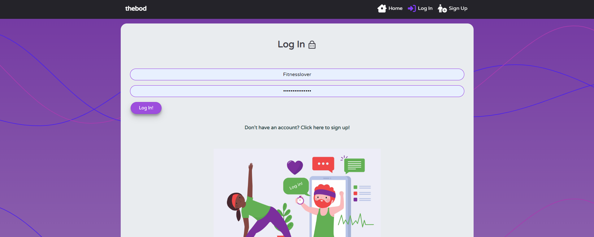
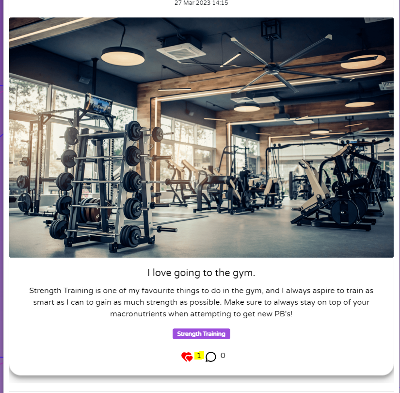
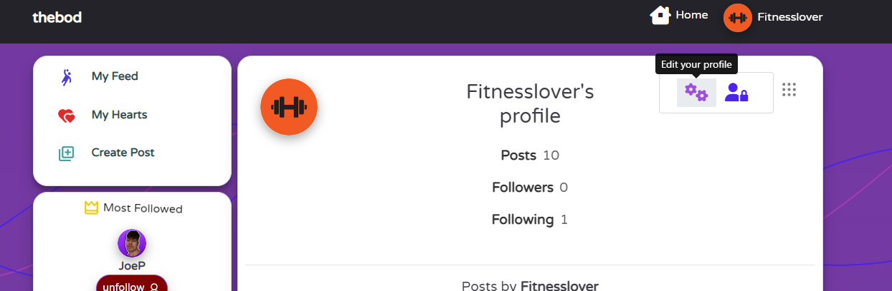
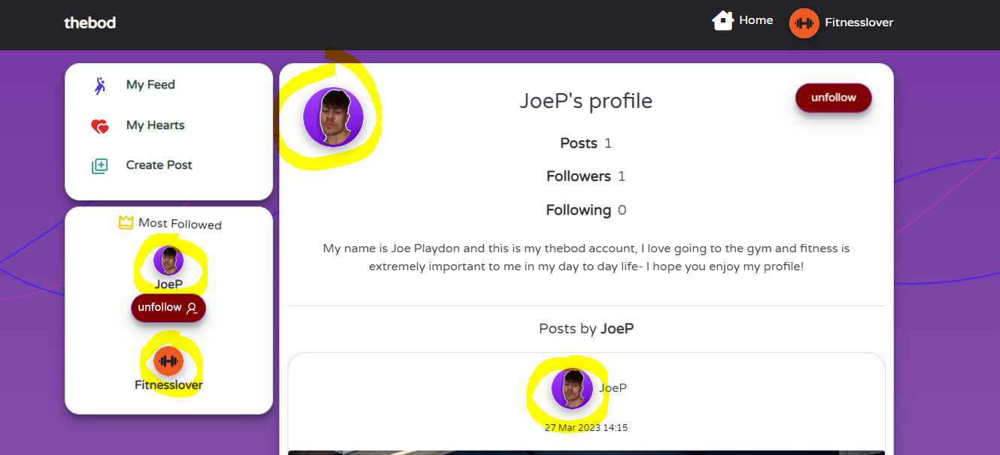

<h1 align="center">"thebod" Fitness and Wellbeing Blog - Project Portfolio 5</h1>
 


## - By Joe Playdon

### [View Live Website](https://thebod-blog.herokuapp.com/) #


## Table of Contents
  - [About](#about)
  - [Project Goals](#project-goals)
  - [User Stories](#user-stories)
  - [Design Choices](#design-choices)
    - [Colour Scheme](#colour-scheme)
    - [Fonts](#fonts)
    - [Wireframes](#wireframes)
  - [Technologies Used](#technologies-used)
    - [Languages](#languages)
    - [Libraries, frameworks and dependencies](#libraries-frameworks-and-dependencies)
    - [Tools & Programs](#tools--programs)
  - [Front-End](#front-end)
  - [Back-End API](#back-end-api)
  - [Features](#application-features-and-screenshots)
  - [Future features / improvements](#future-features--improvements)
  - [Validation](#validation)
  - [Testing](#testing)
    - [Manual testing of user stories](#manual-testing-of-user-stories)
    - [Performing tests on various devices](#performing-tests)
    - [Browser compatibility](#browers-that-ive-tested-on)
  - [Bugs](#bugs)
  - [Configuring of App](#configuring-this-app)
  - [Credits](#credits)


## About

"thebod" is a fitness blog website where users can share images and posts about anything gym related, to keep themselves and users motivated and inspired.
Every user that creates an account can have access to view all posts that have been made- and are able to like the posts that they like, and follow the users that they want to see more posts from (these display in the users feed).
This blog is for all fitness lovers, amateur or expert- to share their healthy and friendly advice with other users. 


## Project Goals

The goal of this project was for me to put a twist on a usual blog, add interactive and fun colour schemes and relate it to fitness- a topic I am passionate about. I really wanted this website to engage the user and have a fun and refreshing feel to it.

Required functions that my website needed:

1. Good user experience and a clear understanding of the user flow
2. User engagement (posting, liking, commenting, following)
3. User login authentication status
4. Full CRUD functionality for posts, comments, likes, followers and profile data
5. Profiles that could be personalised (images, bio)
6. Filtering posts by tags
7. Filtering posts by search functionality of data related to a post (title, user)
8. Like filtering by viewing all previously liked posts
9. Feed filtering by viewing all followed user's posts
10. Mobile responsiveness for website to be fully functionable and accessable on different screen sizes


## User Stories

#### Navigation (Project Goal # Covered: 1, 3)

1. As a user I can view the home page so that I can understand the use and purpose of the blog site
2. As a user I can view the navigation bar at all times so that I have easy access to switch to any page for good user experience
3. As a previous or new user I can view the log in and sign up buttons so that I can log into an account or create an account
 
#### Authentication (Project Goal # Covered: 1, 3)

4. As a new or existing user I can create an account so that I can access all login required features to the website
5. As a previous user I can log into my account so that I can access all features for a logged in user
6. As a user I can remain logged in when changing pages so that I can use the app as I please until I log out

#### Posts (Project Goal # Covered: 1, 2, 4, 9)

7. As a user I can post content on the website so that I can keep my following users up to date on my fitness goals, and upload images
8. As a user I can view the tags related to a post so that I can see how relevant the content is to me as a user
9. As a user I can like or unlike a post so that I can show my opinion on somebody else's content, to give feedback 
10. As a user I can view any other user's specific posts so that I can see all the latest activity on their posts, and see all previous posts they have made
11. As a user I can view the date a post was uploaded on so that I can know how time relevant the post is, and if it is worth viewing

#### Post Detail Page (Project Goal # Covered: 1, 2, 4, 6, 7)

12. As a user I can view more information on a specific post so that I can see the entirety of the content related to the post they have made
13. As a user I can view posts that are associated with tags so that I can search for more specific results catered to me
14. As a user I can comment on a post so that I can show my feedback and share my opinion
15. As a user I can see when a comment was posted so that I know if it is a new or old comment
16. As a user I can edit my comments so that I can change any of my comments and the text inside of them
17. As a user I can click the delete comment button so that I can remove any comments I have made if I choose to 
18. As a user I can edit my posts so that I can change the content in my post if I choose to  

#### Main feed page (Project Goal # Covered: 1, 2, 6, 8, 9)

19. As a user I can view the most recent posts so that I can view the newest and therefor most date relevant content on my feed
20. As a user I can infinitely scroll the website so that I can easily view all posts on the site without interruption
21. As a user I can view the posts that I have previously liked so that I can freely view the content that I like or find informative
22. As a user I can view a list of all relevant posts so that I can see content that has been uploaded by the users I follow
23. As a user I can use the search bar so that I can filter the content I want to see
24. As a user I can view posts that are associated with tags so that I can search for more specific results catered to me

#### Profile Page (Project Goal # Covered: 1, 4, 5)

25. As a user I can upload a profile picture so that I can style my profile to make me recognisable
26. As a user I can view other user's profile pictures so that I can identify the user by their image
27. As a user I can update my profile picture so that I can decide to change my picture if I choose to
28. As a user I can update my profile bio so that I can write a little about myself and personalise my own profile
29. As a user I can change my password so that I can keep my profile secure

#### Other Site Users (Project Goal # Covered: 1, 2)
30. As a user I can view any other user's specific posts so that I can see all the latest activity on their posts, and see all previous posts they have made
31. As a user I can view other profiles so that I can stay up to date on their following, followed and posts
32. As a user I can view a profile picture and a name so that I can check a user's profile page
33. As a user I can view the most popular profiles so that I can see who the most followed users on the site are
34. As a user I can use the follow and unfollow buttons on a user so that I can choose what content I want to see on my feed, and filter the content

#### User Experience(Project Goal # Covered: 1, 10)

35. As a site owner I want my blog app to be responsive so that my users can view the website on any device they choose with any screen size
36. As a user I can view a no results found error page so that I know the page I am on has no content


## Design Choices

### Colour Scheme

My colour scheme that I decided to use within my app was aimed to fun and interactive   to use and look at. The purple background colour (#9247cf) that I chose to use was both abstract and modern but fun to look at- and the goal of my blog was to make sure the journey a user goes through is visually appealing. Firstly, I designed the purple background to work hand in hand with the infinite scrolling functionality due to the fact that the longer the page gets, the background gradients to a lighter colour, keeping the user experience interesting as they scroll further. I kept this purple theme throughout the use of all icons on hover, including the placeholder profile picture a user is assigned on creation of account. The foreground colours are mostly white to allow for a clear depiction of all information displayed to a user when navigating the website (posts, profiles, login/signup pages). Styling this page was one of my favourite parts of creating this project- as it allowed me to explore my creative side.

Furthermore, I kept the toolbar icon colour scheme consistent using a teal colour for the "create post" icon (#51a7a7), a red for the "liked posts"/ "my hearts" icon (#e52828) and finally a dark blue colour (#493fd4) for the "my feed" icon. I wanted these icons to have specific colours for a user to easily identify what they want to do and have an intuitive experience on my site.


### Fonts

For my fonts within my website, I used Google Fonts- as my main font, I decided to use Varela Round as it is very easy to look at and fits the fun style of my website. I wanted a font that wasn't too formal nor informal and Varela fit the style. Sans Serif was the fallback font- due to the fact that the website needed consistent styling and sans also fits the style in case fallback is needed.

### Wireframes
        
  -   I have used [Balsamiq Wireframes](https://balsamiq.com/) as my desired wireframing tool for my website, as it is very easy to use. However, due to these being wireframes, the final image of the website may be depicted differently yet these are base guidelines of my website, and the image I would like to achieve. I have made wireframes for both mobile and desktop views of the website.

  -   Home Page Desktop Wireframe - [View](/docs/wireframes/thebod-home-page.png)

  -   Home Page Mobile Wireframe - [View](/docs/wireframes/thebod-homepage-mobile.png)
  -   Login Page Desktop Wireframe - [View](/docs/wireframes/thebod-login-page.png)

  -   Login Page Mobile Wireframe - [View](/docs/wireframes/thebod-mobile-login.png)

  -   Signup Page Desktop Wireframe - [View](/docs/wireframes/thebod-signup-desktop.png)
  -   Signup Page Mobile Wireframe - [View](/docs/wireframes/thebod-signup-mobile.png)
  -   Home Feed Page Desktop Wireframe - [View](/docs/wireframes/thebod-blog-home-feed.png)
  -   Home Feed Page Mobile Wireframe - [View](/docs/wireframes/thebod-home-mobile-home-feed.png)
  -   Post Detail Page Desktop Wireframe - [View](/docs/wireframes/thebod-blog-post-detail.png)
  -   Post Detail Page Mobile Wireframe - [View](/docs/wireframes/thebod-home-mobile-post-detail%20.png)
  -   Create Post Page Desktop Wireframe - [View](/docs/wireframes/thebod-blog-create-post.png)
  -   Create Post Page Mobile Wireframe - [View](/docs/wireframes//thebod-mobile-post-create.png)
  -   Profile Detail Page Desktop Wireframe - [View](/docs/wireframes/thebod-blog-profile-detail.png)
  -   Profile Detail Page Mobile Wireframe - [View](/docs/wireframes/thebod-profile-detail-mobile.png)
  -   Profile Edit Page Desktop Wireframe - [View](/docs/wireframes/thebod-blog-edit-profile.png)
  -   Profile Edit Page Mobile Wireframe - [View](/docs/wireframes/thebod-profile-edit-mobile.png)
  -   Profile Password Change Page Mobile Wireframe - [View](/docs/wireframes/thebod-passwordchange-mobile.png)

## Technologies Used

### Languages

- React 17.0.2
- Javascript
- HTML
- CSS

### Libraries, frameworks and dependencies

- [Axios](https://axios-http.com/docs/intro) - Axios was used for promise-based HTTP requests. Justification: I have used Axios within my front end to send different types of requests to my API to send and retrieve data for the user to view. This prevented me from getting Cross-origin resource sharing errors (enabled the browser to have controlled access to the data in my api domain).
- [JWT](https://jwt.io/) - this is a library that I used to decode JSON Web tokens. Justification: I used JWT to prevent unauthenticated user from making extra network requests to refresh their access token. This allowed me to set and remove authentication tokens to allow the site to know the login status of a user (if logged out, no authentication token is set within cookies).
- [React 17](https://17.reactjs.org/) - JavaScript library for building user interfaces. Justification: This allowed for multiple encapsulated components to be used that manage their own state. React is extremely useful for this reason, and it also updates the data when data changes.
- [React-Bootstrap 1.6.3](https://react-bootstrap-v4.netlify.app/) - React bootstrap was used to import many different components on my website that are mobile responsive, and have preset classes and styles. Justification: This allowed for a faster building process of the features within my website, as I could have a functional based thought process behind the features, worrying less about html styling.
- [React Router](https://v5.reactrouter.com/web/guides/quick-start) - This was used for dynamic routing. Justification: This was extremely useful as it allowed me to set what content the user views based upon the URL they are visiting. This allowed me to build all pages of my site, and the functional route paths.
- [React Transitions](https://reactcommunity.org/react-transition-group/css-transition) - This was used for the CSS transitions I have used within the fade in of the components on my website. These components fade in and make my website have the fun look that I desired.
- [React Infinite Scroll](https://www.npmjs.com/package/react-infinite-scroll-component) - React Infinite Scroll was a very important feature of my website as the aim was to keep the user engaged. Justification: I used this component to load all content (posts & comments) automatically as the user scrolls towards the bottom of the page, which meant that the content was never taken away from the user.
- [Popper](https://popper.js.org/) - this is a 3rd party library used by React-Bootstrap. Justification: Popper was simply used to position the dropdown menu elements to fixed on screen.

### Tools & Programs

- [Amiresponsive](https://ui.dev/amiresponsive?url=https://thebod-blog.herokuapp.com/) was used to create the design mockups at the top of this README
- [Balsamiq](https://balsamiq.com/) to make my wireframes for different screens
- [Cloudinary](https://cloudinary.com/) to store static files
- [Coolors](https://coolors.co/?home) was used to create the color scheme palette
- [Formito](https://formito.com/tools/favicon) for making my website's favicon
- [Chrome Developer Tools](https://developers.google.com/web/tools/chrome-devtools/) was used for debugging of the code and checking site for responsiveness
- [Google Fonts](https://fonts.google.com/) - for my Varela Rounded font
- [GitHub](https://github.com/) was used as a remote repository to store project code
- [Image Colour Picker](https://imagecolorpicker.com/en) - used colour grabber for favicon colours and logo
- [Image Compressor Picker](https://imagecompressor.com/) - used to compress all images on my site to keep the website higher on performance
- [Git](https://git-scm.com/) was used to commit and push my repository changes to github
- [Font Awesome](https://fontawesome.com/) - icons from Font Awesome were used on my website
- [React Icons](https://react-icons.github.io/react-icons/search) - icons from react-icons were used on my website
- [React Spinners](https://www.davidhu.io/react-spinners/) - spinner came from this website and I changed the coloir
- [Visual Studio Code](https://code.visualstudio.com/) - Was my chosen workspace to code this project
- [Heroku](https://dashboard.heroku.com/apps) was used to deploy my code live
- [ESLint](https://eslint.org/) used to validate JSX code
- [WC3 Validator](https://validator.w3.org/) was used to validate my HTML
- [Lighthouse Tools](https://developers.google.com/web/tools/lighthouse/) used to validate performance, accessibility, best practices and SEO of my website
- [Jigsaw W3 Validator](https://jigsaw.w3.org/css-validator/) was used to validate my CSS

## Front-End

### React

React is a popular and widely-used JavaScript library for building user interfaces. Developed by Facebook, React allows developers to create reusable UI components and manage the state of those components, making it easy to build complex, dynamic, and interactive web applications. React utilizes a virtual DOM, which allows for efficient updates and rendering of components, resulting in fast and responsive applications. With a large and active community, a vast ecosystem of supporting tools and libraries, and a focus on declarative and component-based programming, React has become one of the most popular choices for building modern web applications.

I have used React within building my application for these reasons:
1. Reusability: React's component-based architecture makes it easy to reuse code, allowing you to save time and effort when building your application.

2. Performance: React's use of a virtual DOM allows for fast and efficient updates and rendering of components, resulting in a highly performant user interface.

3. Large and Active Community: React has a large and active community, with a vast ecosystem of supporting tools and libraries, which makes it easier to find solutions to problems and stay up-to-date on the latest developments.

4. Declarative Programming: React allows for declarative programming, which makes it easier to understand and reason about your code, and reduces the likelihood of bugs and errors.

5. Scalability: React is highly scalable, making it well-suited for applications of all sizes, from small, simple projects to large, complex applications.

This project allowed for me to utilize the usefulness of react, due to many different components needing to be rendered on the page at once. 


In order to get my project to function the way I intended, I created many different components to be reused across my app. 

- `<Asset />` - This was my asset component, which changed the asset displayed depending on the props I had provided it. These props were:
  - a loading spinner icon from react-spinners for when content is loading
  - an image with a src attribute
  - a message rendered in a paragraph tag

- `<Avatar />` - Another reusable component, which was used to render the avatar profile picture for a user. Props inside this component allowed for the src attribute to be changed (for example a user changes their avatar). This component was rendered in many different pages (Post, Profile page) and also the `<NavBar/>` component.

- `<DropdownMenu />` - A reusable component that renders the dropdown menu- allowing a user to edit or remove their own content. This can be seen on many pages, for example the post page (own post editing), profile page (editing own profile data) and comments editing.

- `<NavBar />` - A reusable component that is rendered on every page. The content within the navbar changes depending on the authentication status of a user (if not logged in, display icons for login/signup). When a user is logged in, they are shown the avatar component and a dropdown menu allowing them to logout or access their profile.

- `<HomePage />` - A unique component that renders the homepage for users that are not logged in, displaying login/signup buttons for a user.

- `<PageNotFound />` - A unique component that renders the page not found image and message if a 404 error is hit. This page displays a "Go Back" button which uses `history.goBack()` to take the user back to the page they were on before the error.

- `<ScrollToTopButton />` - A reusable component that displays a scroll to top button on the bottom right of the screen if the page is scrolled to a certain point. This allows good user flow of a user to access their toolbar in order to utilse the search functionality and tags at the top of the page.

- `<Toolbar />` - A reusable component that displays icons to allow a user to create a post, view their hearted posts and show their feed (the posts that have been posted by users they follow). This component is reused throughout the majority of my app.

## Back-End API

### Django REST Framework

The backend API for this Front-End application was built with the Django REST Framework. Details about my backend repository can be viewed [here](https://github.com/bodthegod/thebod-drf-api)

# Application Features and Screenshots
### Home Page (Logged Out)
- Brief description of website's purpose, links to log in and sign up forms
- NavBar links to log in and sign up forms
- Contains social links at bottom which open in new tab

<details><summary>Project Feature Screenshot</summary>

</details>

### NavBar
- Displayed on all pages
- If user is logged out - users are displayed "Home", "Log In", "Sign Up" Buttons
- If user is logged in - users are displayed "Home", "Profile Name" Buttons. If profile is clicked then a dropdown menu appears with options to see "My Profile" or "Log out"
- "thebod" title is always displayed and takes you back to the home page on click
- Changes on mobile screens to allow a dropdown menu with all options inside

<details><summary>Project Feature Screenshot</summary>


</details>

### Sign Up Form
- Allows new users to create an account by entering details in form
- The user must provide a valid username (not taken), password and confirm password
- Usernames are unique and two with the same name cannot be created
- User is redirected to login page once signup form is completed

<details><summary>Project Feature Screenshot</summary>

</details>

### Log In Form
- Previous users with created accounts can use this form to log in using their credentials
- The account must be valid, and existing
- The password must be the correct password for the username
- Error messages are displayed if incorrect information
- Logged in user is redirected to general posts page

<details><summary>Project Feature Screenshot</summary>

</details>

### Post Creation and Edit Form
- This form holds an image, title, tags selection and content input area
- You do not have to add text content
- Images and posts can be created and added to your feed to share your fitness advice
- Due to tags, this specifies content for a user easier

<details><summary>Project Feature Screenshot</summary>


</details>

### General Posts Page
- Due to login status, this is the home page for logged in users
- This page contains:
  - Toolbar containing my hearts, my feed and create post
  - Most Followed Users
  - Tags selection on the right
- This page contains all created posts, filtered by created date (most recent)
- When a user has not specified a search, page shows all posts
- Search bar can be used to specify content seen

<details><summary>Project Feature Screenshot</summary>

</details>

### Post Page
- This contains specific details tied to a single post (title, image, content and tags)
- This page contains:
  - Number of likes and like button for user like functionality
  - Number of comments and comment button to allow the user to comment
  - Comment section to display all comments on a post
  
<details><summary>Project Feature Screenshot</summary>

</details>

### Comments Section
- This allows users to leave comments on a post
- This page contains:
  - Day and hours commented 
  - If user owns the comment, they are able to edit or remove the comment

<details><summary>Project Feature Screenshot</summary>

</details>

### Hearts
- This allows users to leave a heart on a post
- If hearted, heart icon goes full instead of outline and red
- A user cannot heart the post that they have created
- A user can view all the posts they have hearted before using the "my hearts" section

<details><summary>Project Feature Screenshot</summary>

</details>

### Profile Page
- Contains user profile information
- Shows how many posts the user has created, followers and following
- Contains a dropdown menu to edit the profile and change profile password
- If a user has added a bio, this is displayed here

<details><summary>Project Feature Screenshot</summary>

</details>

### Profile Picture
- User is assigned default profile picture when creating a new profile
- This is reused throughout the website (displayed on a comment, navbar, profile, post, most followed)

<details><summary>Project Feature Screenshot</summary>

</details>

### User Password Edit/Change Form
- User can edit their password and save it to reflect changes

<details><summary>Project Feature Screenshot</summary>

</details>

### Infinite Scroll
- Displays all posts that have been posted on the site, allowing for uninterrupted content stream for user
- Comments are rendered infintely, and so are posts
- Displays spinner when posts are loading

<details><summary>Project Feature Screenshot</summary>

</details>

### User Icons Toolbar
- A user can view their followed feed from the Toolbar
- Used consistently throughout all pages (apart from form pages)
- A user can view their hearted posts
- A user can also create posts using the Toolbar

<details><summary>Project Feature Screenshot</summary>

</details>

### Scroll To Top Button
- Designed to be user friendly on mobile devices, allowing quick access to toolbar if user wants to access other pages
- Created to prevent taking control away from user flow on application
- Animated to give visual prompt to user that it goes back to the top of page

<details><summary>Project Feature Screenshot</summary>

</details>

### Following and Unfollowing
- Users can follow and unfollow any post that they desire, to allow them to have access to that user's posts in their feed
- This can be done from the most followed section and the profile section

<details><summary>Project Feature Screenshot</summary>


</details>

### Most Followed Users
- A user can view the most followed profiles on page
- Follow and unfollow buttons are displayed below the most popular profiles if a user wants to view their content on their personal feed
- This is visible on all pages apart from forms
- Maximum of 5 most popular users on profile to allow for user friendly layout if there are many accounts created
- On mobile there is a scrollbar visible to allow for shortened content and user friendly scrolling

<details><summary>Project Feature Screenshot</summary>

</details>

### Search Bar
- A user can use the search bar to find a user profile or a post
- A user can search for any keyword they are interested in and it will show all related results
- Search functionality can be used within the "my hearts" and "feed" section to filter content inside the posts they enjoy
- Search is linked to the:
1. User (owner) of created post
2. Tags of created post
3. Content of created post

<details><summary>Project Feature Screenshot</summary>

</details>

### Tags Section
- A user can view and click on any tag they want to search for to get all posts associated with that tag

<details><summary>Project Feature Screenshot</summary>

</details>

### 404 Page Not Found Page
- If a URL that doesn't exist is entered, this page is displayed to give visual feedback to the user that it is incorrect
- A "Go back" button is displayed to take the user back to the page they were previously on

<details><summary>Project Feature Screenshot</summary>

</details>


## Future features & improvements

Improvements I feel could be made to my application:

- Authentication
  - Allow account creation and signup using different social media platform accounts (Google, Facebook etc.)
  - Password reset if a user forgets it sent through email 
  - Authentication tokens being set on `localStorage()` if user is not on IOS, and cookies if on IOS.
- Posts
  - Video uploads
  - Voice memo's for user to send via comments
- Profile
  - Profile commenting
  - Profile liking
- Comments
  - Comment liking
- App rework on IOS due to `localStorage()` authentication token bugs
  - Create Post Rework (401 Unauthorised Bug)
  - Like Rework (401 Unauthorised Bug)
  - Edit Post and Profile Rework (401 Unauthorised Bug)

## Validation

### HTML
I used the W3C Markup Validation Service to validate my HTML code. As you can see, no errors were found within my HTML.


<details><summary>Home page (Logged Out)</summary> 
 
</details> 
<details><summary>Login Page</summary> 
 
</details> 
<details><summary>Sign Up Page</summary> 
 
</details> 
<details><summary>Posts Page</summary> 
 
</details> 
<details><summary>My Feed Page</summary> 
 
</details> 
<details><summary>Hearted Posts Page</summary> 
 
</details> 
<details><summary>Create Post Page</summary> 
 
</details> 
<details><summary>Edit Post Page</summary> 
 
</details> 
<details><summary>Profiles Page</summary> 
 
</details> 
<details><summary>Edit Profile Page</summary> 
 
</details> 
<details><summary>Edit Password Page</summary> 
 
</details> 
<details><summary>404 Page Not Found Page</summary> 
 
</details> 


### CSS

I used the W3C Jigsaw CSS Validation Service to validate the CSS of my website. All of my CSS modules that were imported within my js files were validated.

<details><summary>App.module.css</summary> 
 
</details> 

<details><summary>Index.css</summary> 
 
</details> 

<details><summary>Asset.module.css</summary> 
 
</details> 

<details><summary>Avatar.module.css</summary> 
 
</details> 

<details><summary>Button.module.css</summary> 
 
</details> 

<details><summary>Comment.module.css</summary> 
 
</details> 

<details><summary>CommentCreateEditForm.module.css</summary> 
 
</details> 

<details><summary>DropdownMenu.module.css</summary> 
 
</details> 

<details><summary>GeneralPostsPage.module.css</summary> 
 
</details> 

<details><summary>HomePage.module.css</summary> 
 
</details> 

<details><summary>LogInSignUpForm.module.css</summary> 
 
</details> 

<details><summary>NavBar.module.css</summary> 
 
</details>

<details><summary>PageNotFound.module.css</summary> 
 
</details> 

<details><summary>PopularProfiles.module.css</summary> 
 
</details> 

<details><summary>Post.module.css</summary> 
 
</details> 

<details><summary>PostCreateEditForm.module.css</summary> 
 
</details>

<details><summary>Profile.module.css</summary> 
 
</details> 

<details><summary>ProfilePage.module.css</summary> 
 
</details> 

<details><summary>ScrollBar.module.css</summary> 
 
</details> 

<details><summary>ScrollToTopButton.module.css</summary> 
 
</details> 

<details><summary>Toolbar.module.css</summary> 
 
</details> 

### JSX
I have used ESLint to validate my JSX code.
Initially, I had linting errors such as:

- An error with apostrophes, and I had to replace them with `&apos;`.
- Empty block statements from where I removed my `console.log()`s. I fixed this by adding return statements to return the errors.
- Missing imports of `React`, this I fixed by importing `React` in the appropriate files.
Here you can see that I have validated every single page of my JSX code after fixing these issues, and it returned no errors.

<details><summary>Eslint validation for all files</summary> 
 
</details> 

### Lighthouse Report 

Lighthouse was used to test the performance, accessibility, best practice and SEO of the site. The validation was done for both desktop & mobile.  

#### Desktop Report 

<details><summary>Home page</summary> 
 
</details> 

<details><summary>General Posts page</summary> 
 
</details> 

#### Mobile Report

<details><summary>Home page</summary> 
 
</details> 

<details><summary>General Posts page</summary> 
 
</details> 

## Testing
 
### Manual testing of user stories

1. As a user I can view the home page so that I can understand the use and purpose of the blog site.

**Action** | **Expected Result** | **Actual Result**
------------ | ------------ | ------------ |
Go to https://thebod-blog.herokuapp.com/ | Home Page shows purpose of site and what it can be used for | Works as expected |
 
<details><summary>User Story Test Screenshot</summary>

</details>

2.  As a user I can view the navigation bar at all times so that I have easy access to switch to any page for good user experience.

**Action** | **Expected Result** | **Actual Result**
------------ | ------------ | ------------ |
View any page of website using nav links and toolbar | Navbar and toolbar shows different navigation links | Works as expected |
 
<details><summary>User Story Test Screenshot</summary>


</details>

3.  As a previous or new user I can view the log in and sign up buttons so that I can log into an account or create an account.

**Action** | **Expected Result** | **Actual Result**
------------ | ------------ | ------------ |
View login and signup buttons to create an account or log in | Navbar shows different login/signup links and so does home page | Works as expected |
 
<details><summary>User Story Test Screenshot</summary>

</details>

4.  As a new or existing user I can create an account so that I can access all login required features to the website.

**Action** | **Expected Result** | **Actual Result**
------------ | ------------ | ------------ |
Create an account in signup form | Site allows me to create an account using the signup form and I am logged in | Works as expected |
 
<details><summary>User Story Test Screenshot</summary>



</details>

5.  As a previous user I can log into my account so that I can access all features for a logged in user.

**Action** | **Expected Result** | **Actual Result**
------------ | ------------ | ------------ |
Log in to account using log in form | Site allows me to log into an account if I have signed up up previously | Works as expected |
 
<details><summary>User Story Test Screenshots</summary>


</details>

6.  As a user I can remain logged in when changing pages so that I can use the app as I please until I log out.

**Action** | **Expected Result** | **Actual Result**
------------ | ------------ | ------------ |
Stay logged in when changing pages by clicking onto different sections of site | Site keeps me logged in using authentication tokens assigned to my browser | Works as expected |
 
<details><summary>User Story Test Screenshots</summary>


</details>

7.  As a user I can post content on the website so that I can keep my following users up to date on my fitness goals, and upload images.

**Action** | **Expected Result** | **Actual Result**
------------ | ------------ | ------------ |
Create a post with a chosen tag using create post button | Site should allow for a post to be created and uploaded to the home page with a description | Works as expected |
 
<details><summary>User Story Test Screenshots</summary>


</details>

8.  As a user I can view the tags related to a post so that I can see how relevant the content is to me as a user.

**Action** | **Expected Result** | **Actual Result**
------------ | ------------ | ------------ |
View a tag on a post by looking on any posts page | Site should allow for me to view the tags on any post under the content | Works as expected |
 
<details><summary>User Story Test Screenshots</summary>

</details>

9.  As a user I can like or unlike a post so that I can show my opinion on somebody else's content, to give feedback.

**Action** | **Expected Result** | **Actual Result**
------------ | ------------ | ------------ |
Click the heart icon under another person's post | The hearts number should go up, and the heart icon should go red | Works as expected |
 
<details><summary>User Story Test Screenshots</summary>


</details>

10. As a user I can view any other user's specific posts so that I can see all the latest activity on their posts, and see all previous posts they have made.

**Action** | **Expected Result** | **Actual Result**
------------ | ------------ | ------------ |
Click on a person's profile image to view their profile and posts | If I click a profile image, it should take me to a user's profile containing all their posts | Works as expected |
 
<details><summary>User Story Test Screenshots</summary>

</details>

11. As a user I can view the date a post was uploaded on so that I can know how time relevant the post is, and if it is worth viewing.

**Action** | **Expected Result** | **Actual Result**
------------ | ------------ | ------------ |
View a post from any page | If I view any page, the date it was posted should be shown in the post content | Works as expected |
 
<details><summary>User Story Test Screenshots</summary>

</details>

12. As a user I can view more information on a specific post so that I can see the entirety of the content related to the post they have made.

**Action** | **Expected Result** | **Actual Result**
------------ | ------------ | ------------ |
Click a post, view post description, tags and comments | If I view any page, the date it was posted should be shown in the post content | Works as expected |
 
<details><summary>User Story Test Screenshots</summary>

</details>

13. As a user I can view posts that are associated with tags so that I can search for more specific results catered to me.

**Action** | **Expected Result** | **Actual Result**
------------ | ------------ | ------------ |
I can filter posts by tags by clicking on the tags section on the right | If I click the tags filter, it should show me ONLY the posts that are associated with that tag | Works as expected |
 
<details><summary>User Story Test Screenshots</summary>

</details>

13. As a user I can view posts that are associated with tags so that I can search for more specific results catered to me.

**Action** | **Expected Result** | **Actual Result**
------------ | ------------ | ------------ |
I can filter posts by tags by clicking on the tags section on the right | If I click the tags filter, it should show me ONLY the posts that are associated with that tag | Works as expected |

14. As a user I can comment on a post so that I can show my feedback and share my opinion.

**Action** | **Expected Result** | **Actual Result**
------------ | ------------ | ------------ |
I can click on the comments section, type a comment and click post and it will show in the comments section | When I type a comment and post it, it stays in the comment section | Works as expected |
 
<details><summary>User Story Test Screenshots</summary>

</details>

15. As a user I can see when a comment was posted so that I know if it is a new or old comment.

**Action** | **Expected Result** | **Actual Result**
------------ | ------------ | ------------ |
I can view the time a comment was posted by looking in the comments section | The comment should be displayed with "time": ago | Works as expected |
 
<details><summary>User Story Test Screenshots</summary>

</details>

16. As a user I can edit my comments so that I can change any of my comments and the text inside of them.

**Action** | **Expected Result** | **Actual Result**
------------ | ------------ | ------------ |
I can click on the edit dots, and click edit comment if I own it | The comment should allow the owner to edit it and update the content | Works as expected |
 
<details><summary>User Story Test Screenshots</summary>


</details>

17. As a user I can click the delete comment button so that I can remove any comments I have made if I choose to.

**Action** | **Expected Result** | **Actual Result**
------------ | ------------ | ------------ |
I can click on the edit dots, and click delete comment if I own it | The comment should allow the owner to delete it and it disappears | Works as expected |
 
<details><summary>User Story Test Screenshots</summary>


</details>

18. As a user I can edit my posts so that I can change the content in my post if I choose to.

**Action** | **Expected Result** | **Actual Result**
------------ | ------------ | ------------ |
I can click on the edit post dots, and click edit post if I own it | The post should allow the user to edit it and show an edit form if they own the post | Works as expected |
 
<details><summary>User Story Test Screenshots</summary>


</details>

19. As a user I can view the most recent posts so that I can view the newest and therefor most date relevant content on my feed.

**Action** | **Expected Result** | **Actual Result**
------------ | ------------ | ------------ |
I can view the most recent posts in order from newest first at the top | Posts should be displayed newest first | Works as expected |
 
<details><summary>User Story Test Screenshots</summary>

</details>

20. As a user I can infinitely scroll the website so that I can easily view all posts on the site without interruption.

**Action** | **Expected Result** | **Actual Result**
------------ | ------------ | ------------ |
I can keep scrolling past 10 posts to view more content | If I scroll, scrolling should never be interrupted unless there is no content left to view | Works as expected |
 
<details><summary>User Story Test Screenshots</summary>

</details>

21. As a user I can view the posts that I have previously liked so that I can freely view the content that I like or find informative.

**Action** | **Expected Result** | **Actual Result**
------------ | ------------ | ------------ |
Click "my hearted posts" and user should be displayed with all posts they have hearted | All posts that have been liked by the user should be shown in this section | Works as expected |
 
<details><summary>User Story Test Screenshots</summary>

</details>

22. As a user I can view a list of all relevant posts so that I can see content that has been uploaded by the users I follow.

**Action** | **Expected Result** | **Actual Result**
------------ | ------------ | ------------ |
Click "my feed" and user should be displayed with all posts that are from a followed user | All posts from followed users should be shown in this section | Works as expected |
 
<details><summary>User Story Test Screenshots</summary>

</details>

23. As a user I can use the search bar so that I can filter the content I want to see.

**Action** | **Expected Result** | **Actual Result**
------------ | ------------ | ------------ |
Click search bar, search for content and related content should be displayed | All posts that have relative usernames and titles should be displayed | Works as expected |
 
<details><summary>User Story Test Screenshots</summary>

</details>

24. As a user I can view posts that are associated with tags so that I can search for more specific results catered to me.

**Action** | **Expected Result** | **Actual Result**
------------ | ------------ | ------------ |
Click tags | All posts with the same tags as the ones clicked should be shown | Works as expected |
 
<details><summary>User Story Test Screenshots</summary>

</details>

25. As a user I can upload a profile picture so that I can style my profile to make me recognisable.

**Action** | **Expected Result** | **Actual Result**
------------ | ------------ | ------------ |
Click edit profile, click edit picture and save | Profile picture should be editable and change the user's image | Works as expected |
 
<details><summary>User Story Test Screenshots</summary>


</details>

26. As a user I can view other user's profile pictures so that I can identify the user by their image.

**Action** | **Expected Result** | **Actual Result**
------------ | ------------ | ------------ |
View other user's profile picture on any page | Profile pictures should be displayed on all pages where user has posted content | Works as expected |
 
<details><summary>User Story Test Screenshots</summary>

</details>

27. As a user I can update my profile picture so that I can decide to change my picture if I choose to.

**Action** | **Expected Result** | **Actual Result**
------------ | ------------ | ------------ |
Click edit profile, click edit picture and save | Profile picture should be updated to whatever file is chosen | Works as expected |
 
<details><summary>User Story Test Screenshots</summary>


</details>

28. As a user I can update my profile bio so that I can write a little about myself and personalise my own profile.

**Action** | **Expected Result** | **Actual Result**
------------ | ------------ | ------------ |
Click edit profile, type bio and save | Bio should be updated and shown in user's profile section | Works as expected |
 
<details><summary>User Story Test Screenshots</summary>



</details>

29. As a user I can change my password so that I can keep my profile secure.

**Action** | **Expected Result** | **Actual Result**
------------ | ------------ | ------------ |
Click edit password, type password and save | Password should be changed for user | Works as expected |
 
<details><summary>User Story Test Screenshots</summary>


</details>

30. As a user I can view any other user's specific posts so that I can see all the latest activity on their posts, and see all previous posts they have made.

**Action** | **Expected Result** | **Actual Result**
------------ | ------------ | ------------ |
Click on profile, all posts from that profile will be displayed. | A list of all posts from a user should be displayed in their profile, along with a number of their total posts | Works as expected |
 
<details><summary>User Story Test Screenshots</summary>

</details>

31. As a user I can view other profiles so that I can stay up to date on their following, followed and posts.

**Action** | **Expected Result** | **Actual Result**
------------ | ------------ | ------------ |
Click on profile. | A number of posts, followers and following should be displayed on a user profile | Works as expected |
 
<details><summary>User Story Test Screenshots</summary>

</details>

32. As a user I can view a profile picture and a name so that I can check a user's profile page.

**Action** | **Expected Result** | **Actual Result**
------------ | ------------ | ------------ |
View a profile from any post that has been made, comments etc. | Profile pictures should be displayed alongside any of the user's content | Works as expected |
 
<details><summary>User Story Test Screenshots</summary>

</details>

33. As a user I can view the most popular profiles so that I can see who the most followed users on the site are.

**Action** | **Expected Result** | **Actual Result**
------------ | ------------ | ------------ |
View all popular profiles in the 'Most Followed' section | Profiles with most followers should be displayed at the top of the most followed list | Works as expected |
 
<details><summary>User Story Test Screenshots</summary>

</details>

34. As a user I can use the follow and unfollow buttons on a user so that I can choose what content I want to see on my feed, and filter the content.

**Action** | **Expected Result** | **Actual Result**
------------ | ------------ | ------------ |
View follow and unfollow button in most followed profiles section and profile | Button can be clicked and unclicked to allow a user to follow and unfollow a profile | Works as expected |
 
<details><summary>User Story Test Screenshots</summary>

</details>

35. As a site owner I want my blog app to be responsive so that my users can view the website on any device they choose with any screen size.

**Action** | **Expected Result** | **Actual Result**
------------ | ------------ | ------------ |
Website is mobile responsive | Site can be accessed on different screen sizes and functions as expected | Works as expected |
 
<details><summary>User Story Test Screenshots</summary>

</details>

36. As a site owner I want my blog app to be responsive so that my users can view the website on any device they choose with any screen size.

**Action** | **Expected Result** | **Actual Result**
------------ | ------------ | ------------ |
No results page shows when an incorrect URL is typed | No results graphic and go back button is displayed when a user incorrectly navigates to an incorrect URL | Works as expected |
 
<details><summary>User Story Test Screenshots</summary>

</details>

### Performing Tests

I built and tested this website using Google Chrome Developer tools- which allowed me to test specific breakpoints for different screen sizes.

I tested this website using:
- Samsung Galaxy A54 (mobile)
- My Windows PC (desktop)
- Lenovo M10 (tablet)
- IPhone 11 Pro (mobile)
- IPad Mini (tablet)

### Browers that I've tested on

Testing has been carried out on the following browsers:
- Googe Chrome
- Firefox
- Microsoft Edge
- IOS

## Bugs

| **Bug** | **Fix** |
| ------- | ------- |
| Dropdown menu overlaying post image | Edited margin-bottom of element to -12px |
| Console warning: Please use ```require("react-router-dom").NavLink``` instead of ```require("react-router-dom/NavLink")```. Support for the latter will be removed in the next major release. | Changed NavLink from "react-router-dom/NavLink"; to import { NavLink } from "react-router-dom", error displays due to version of `react-router-dom` however does not affect project as version will not change|
| Lighthouse Validation saying contrast of unfollow button wasn't high enough | Changed unfollow button colour for better visual cues|

- Bug fix: I had a bug where the navbar profile picture would show, however for an unknown reason the profile pictures that were not specified by the UseCurrentUser() method would not display when tied to the post list and detail views. To fix this, there was lots of trial and error- however I finally discovered that it was down to a very minute detail within the PostSerializer.py file within my API. `profile_image = serializers.ReadOnlyField(source='owner.profile.image.id')`. After understanding this issue, I had realised the final `.id` should have been `.url`- and this fixed the bug once I had committed my changes to my API and pushed them to the deployed project.

- Bug fix: I manually tested every function of my website, however cross tab errors were apparent in the form of user authentication when logged out in one tab, yet accessible in another. In order to fix this, I created a function to log out a user when they make a 401 Unauthorised request to the API. Before this fix, this bug could be replicated by logging in on two different accounts on two tabs (user is assigned two authentication cookies), then one of the tabs logs out and into another account and finally when accessing the previous browser which already had a token assigned, this gave cross tab authentication to the currently logged in user- allowing them to like their own post. 

To prevent this bug, I created a function to clear cookies on log out- and if there are no cookies assigned to the browser on data response or request: log out the user. Working around this bug was challenging as it was hard to replicate.

It also must be known that I have added a custom error display only for users that are on connections that are not secure (Secure Sockets Layer disabled). SSL (Secure Sockets Layer) is a security protocol that is used to encrypt data that is transmitted over the internet. SSL works by establishing a secure connection between a web server and a client (such as a web browser), ensuring that any data that is transmitted between the two is encrypted and therefore protected from interception by unauthorized parties.

If a user tries to access the website on a non `https://` URL, login functionality will not work as I have created error handling to prevent incorrect routes as no cookies can be applied to any unsecure link.

I created this error handling function to prevent a bug that presented the user with a blank white screen due to a CORS error- as the user would request data from an unencrypted link. CORS is a security mechanism that helps prevent malicious attacks and controls access to resources across different domains on the internet. It is an important tool for any developer to ensure the security and integrity of their applications and websites.

## Known Bugs

- These are bugs that I have troubleshooted and due to time constraints was unable to fix.

Known Bugs: A major bug I had experienced is the authentication tokens giving a 401 error on mobile, but not on desktop. This bug was very confusing and I had worked relentlessly at attempting to fix it with no avail. When a user attempts to log on my website using IOS, they are presented with an invalid refresh token and redirected back to the login page- which is incredibly confusing due to the full functionality on desktop devices. On desktop, login is authorised and the user is assigned a refresh token.

I had searched for a fix and due to time constraints could not replicate a full fix without ios developer tools. Due to the nature of this bug being only on IOS devices, when accessing the app from an IPhone, I could not debug the source of the issue from the console- and when viewing the logs from the deployed API to see what requests were being posted, it would result in a 401 unauthorised error. When attempting to replicate this bug on desktop, it would post a 200 OK message with the same code. Due to this, I thought it could have been a possible bug with the packages I had installed, or the token refresh logic.

In an attempt to fix this bug, initially I had discovered that `localStorage()` does not function correctly when working on IOS, and this allowed me to understand the root of the issue more thoroughly. Due to `localStorage()` not assigning the refresh token to the user on login, the catch block would hit and my user would be redirected back to the login screen, hence the infinite loop of 401 Unauthorised errors.

Firstly, I attempted to use [react-device-detect](https://www.npmjs.com/package/react-device-detect) to assign cookies on only IOS, due to the lack of functionality of localStorage- however this presented more bugs and did not function the way I intended it to. Moreover, after many hours of trial and error to fix this bug that only happened on IOS devices, I searched up on forums of ways around using `localStorage()`, giving me the idea to store the user's refresh token as a cookie on both IOS and mobile using [react-cookie](https://www.npmjs.com/package/react-cookie). Due to using this solution, the functionality worked correctly on mobile, and login functionality worked on IOS devices.

Due to the workaround I created, this meant that other bugs arose however now login functionality worked on IOS, however other functions did not. On desktop and android devices, my website is fully functional and up to standard. 

I am aware of the issues that arise on IOS devices however due to the lack of `localStorage()` functionality it was very hard to find a workaround. Fixing this bug was very time consuming, as I could not run the changes on localhost to test for IOS functionality- meaning I had to redeploy my respository through Heroku to detect the bugs and changes for IOS.

## Configuring this App

### Forking the GitHub Repository

By forking the GitHub Repository we make a copy of the original repository on our GitHub account to view and/or make changes without affecting the original repository by using the following steps...

1. Log in to GitHub and locate the [GitHub Repository](https://github.com/bodthegod/thebod-app)
2. At the top of the Repository (not top of page) just above the "Settings" Button on the menu, locate the "Fork" Button.
3. You should now have a copy of the original repository in your GitHub account.

### Making a Local Clone

1. Log in to GitHub and locate the [GitHub Repository](https://github.com/bodthegod/thebod-app)
2. Under the repository name, click "Clone or download".
3. To clone the repository using HTTPS, under "Clone with HTTPS", copy the link.
4. Open Git Bash
5. Change the current working directory to the location where you want the cloned directory to be made.
6. Type `git clone`, and then paste the URL you copied in Step 3.

```
$ git clone https://github.com/bodthegod/thebod-app
```

7. Press Enter. Your local clone will be created.

```
$ git clone https://github.com/bodthegod/thebod-app
> Cloning into `thebod-app-clone`...
> remote: Counting objects: 10, done.
> remote: Compressing objects: 100% (8/8), done.
> remove: Total 10 (delta 1), reused 10 (delta 1)
> Unpacking objects: 100% (10/10), done.
```

Click [Here](https://help.github.com/en/github/creating-cloning-and-archiving-repositories/cloning-a-repository#cloning-a-repository-to-github-desktop) to retrieve pictures for some of the buttons and more detailed explanations of the above process.

## Credits

### Image Credits

- Icon upload image from [here](https://www.flaticon.com/free-icon/upload_8045653?term=upload&page=1&position=91&origin=tag&related_id=8045653)
- No results found search image (edited) [here](https://dribbble.com/shots/9326781-No-Results-Found-Illustration)
- Login/Signup for images (edited) [here](https://www.freepik.com/free-vector/virtual-gym-from-home-concept_7775281.htm#query=fitness%20cartoon%20sign%20up&position=18&from_view=search&track=ais) 
- The images that have been posted as placeholder example posts are not my images. Since these are example images they were used for testing, and I found these from google. As this project is a non-profit, education application and there are alot of images, I could not find credits for all- however never use an image without credit or permission if you are creating a profit based project.

### Style Credits and Inspirations

- Icon shake animations (edited) [here](https://unused-css.com/blog/css-shake-animation/) 
- Box shadow inspirations [here](https://getcssscan.com/css-box-shadow-examples)
- Home page blog background [here](https://bgjar.com/wave-line)
- CSS Animations inspiration [here](https://blog.hubspot.com/website/css-animation-examples)
- Inspiration of bounce animations [here](https://stackoverflow.com/questions/29005916/make-button-bounce-with-css3)
- 404 Page not found image [here](https://www.freepik.com/free-vector/error-404-concept-landing-page_5156008.htm#page=2&query=page%20not%20found&position=44&from_view=search&track=ais)


### Code Inspirations

This project was inspired by the ['Moments'](https://github.com/Code-Institute-Solutions/moments) social media website which was my final walk-through project with Code Institute. I have created my own styles, animations and functionalities, as to which a user can search my tags that are assigned to any created post by a user. This website could be built apon further as seen in the 'improvements' section.

### Project Acknowledgements

Building this project was fun, interesting and an enjoyable learning experience throughout the entire process. I cannot wait to build more- my major thanks go out to:
- Mo, my mentor throughout this project who gave me brilliant guidance, insights, support and encouragement throughout every step of this project.


